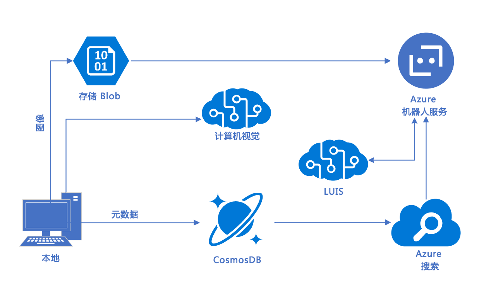

# 实验室 1：技术要求

## 简介

在本实验中，我们将介绍我们的研讨会案例研究以及你的本地工作站和 Azure 实例中的设置工具，以便你可以在 Microsoft 认知服务套件中生成工具。

## 研讨会案例研究

你已分配新客户 Adventure Works LLC，这个客户向其客户销售自行车和自行车装备。

Adventure Works Cycles 是一家大型跨国制造公司。它制造自行车和自行车组件，并通过互联网渠道和经销商分销网络将产品销售到北美、欧洲和亚洲商业市场。它的总部设在华盛顿州柯克兰，拥有 290 名员工，在其整个市场群中设有多个区域销售团队。

在上一个财年取得成功后，Adventure Works 希望通过向现有客户销售额外产品来增加收入。去年，市场部启动了一项计划，他们在各种贸易展览和赛车活动中手动收集 Adventure Works 产品的产品评级数据。这些数据当前保存在 Microsoft Excel 文件中。

他们已经能够证明，利用所收集的信息，他们能够通过对评级结果进行人工分析来向现有客户群销售其他产品。营销团队希望通过在 Adventure Works 网站上创建在线调查来扩大规模，但是销售部听说了他们的努力并创建了在线调查。在此平台上进行的调查效果非常差，并且字段与 Excel 文件中收集的数据不一致。

市场部坚信，他们可以使用评级数据来推荐有关其他产品的建议，以此作为业务的追加销售机会。然而，事实证明，将调查放在网站上很难获得所需的数据，并且他们正在寻求有关如何改善这种情况的建议。此外，团队意识到，随着客户越来越多，人工执行分析将变得非常困难。

 Adventure Works 旨在无缝扩展规模，以处理使用多种语言的大量客户查询。此外，他们希望创建可扩展的客户服务平台，以获取有关客户需求、问题和产品评级的更多信息。

此外，客户服务部门希望将其一些客户支持功能转移到交互式平台上。目的是通过快速回答常见问题来减少员工的工作量并提高客户满意度。

### 解决方案

交互式平台被设想为一个由以下功能组成的机器人：

- 检测客户的语言（此时仅支持英语）

- 监控用户情绪

- 允许上传图片并确定上传对象是否是自行车

- 将常见问题解答集成到聊天机器人中

- 根据机器人聊天中输入的文本确定用户的意图

- 记录聊天机器人会话以供以后查看

我们将构建一个简单的 C# 应用程序，它允许你从本地驱动器中引入图片，然后调用[计算机视觉 API](https://www.microsoft.com/cognitive-services/zh-cn/computer-vision-api) 以分析图像并获取标记和描述。

在这个实验的后续部分，我们将向你展示如何构建一个 [Bot Framework](https://dev.botframework.com/) 机器人，以与客户的文本查询进行交互。然后，我们将展示一个快速解决方案，用于将现有的知识库和常见问题解答集成到带有 [QnA Maker](https://docs.microsoft.com/zh-cn/azure/cognitive-services/qnamaker/overview/overview) 的机器人框架中。最后，我们将通过 [LUIS](https://www.microsoft.com/cognitive-services/zh-cn/language-understanding-intelligent-service-luis) 扩展这个机器人，以自动从查询中获取意图，并使用这些信息智能地响应客户的文本请求。

我们将仅提供用于使用必应搜索的上下文，以使客户能够在与机器人交互期间访问其他数据，但在实验期间不会实现这些方案。参与者会受邀阅读关于[必应 Web 搜索](https://azure.microsoft.com/zh-cn/services/cognitive-services/directory/search/)服务的更多信息。

虽然超出了这个实验的范围，但这个体系结构会集成 Azure 的数据解决方案，通过 [Blob 存储](https://docs.microsoft.com/zh-cn/azure/storage/storage-dotnet-how-to-use-blobs)和 [Cosmos DB](https://azure.microsoft.com/zh-cn/services/cosmos-db/) 管理这个体系结构中图像和元数据的存储。

### 体系结构

你的团队最近提出了一个经过 Adventure Works 批准的潜在体系结构（如下所示）：

- [计算机视觉](https://azure.microsoft.com/zh-cn/services/cognitive-services/computer-vision/)允许上传图像，检测内容
- [QnA Maker](https://azure.microsoft.com/zh-cn/services/cognitive-services/qna-maker/) 通过静态知识库促进机器人交互
- [文本分析](https://azure.microsoft.com/zh-cn/services/cognitive-services/text-analytics/)允许语言检测
- [LUIS](https://docs.microsoft.com/zh-cn/azure/cognitive-services/LUIS/Home)（语言了解智能服务）
从文本中提取意图和实体
- [Azure 机器人服务](https://azure.microsoft.com/zh-cn/services/bot-service/)连接器服务，使聊天机器人界面能够利用应用智能

## 后续步骤

- [实验 01-02：技术要求](02-Technical_Requirements.md)