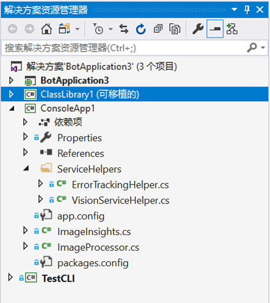

# 实验验室 2 - 实现计算机视觉

## 简介

我们将构建一个端到端的应用程序，它允许你引入自己的图片，使用认知服务获取描述文字和一些关于图像的标记。在后面的实验室中，我们将使用 LUIS 构建一个 Bot Framework 机器人，以便轻松且有针对性地查询此类图像。

## 实验室 2.0：目标

在本实验室中，你将：

- 了解各种认知服务 API
- 了解如何配置应用以调用认知服务
- 构建一个在 .NET 应用程序中调用各种认知服务 API（尤其是计算机视觉）的应用程序

虽然重点是认知服务，但你还将使用 Visual Studio 2019。

> **注意：** 如果你还没有帐户，请按照指示创建 Azure 帐户和认知服务，并在 [Lab1-Technical_Requirements.md](../Lab1-Technical_Requirements/02-Technical_Requirements.md) 中获取 API 密钥。

## 实验室 2.1：体系结构

我们将构建一个简单的 C# 应用程序，它允许你从本地驱动器中引入图片，然后调用[计算机视觉 API](https://www.microsoft.com/cognitive-services/zh-cn/computer-vision-api) 以分析图像并获取标记和描述。

在这个实验室的后续部分，我们将向你展示如何查询数据，以及构建 [Bot Framework](https://dev.botframework.com/) 机器人以进行查询。最后，我们将通过 [LUIS](https://www.microsoft.com/cognitive-services/zh-cn/language-understanding-intelligent-service-luis) 扩展这个机器人，以自动从查询中获取意图，并使用这些信息智能地指导搜索。


## 实验室 2.2：资源

[主要](https://github.com/MicrosoftLearning/AI-100ZH-Design-Implement-Azure-AISol/blob/master/Lab2-Implement_Computer_Vision/) github 存储库文件夹中有一些目录：

- **sample_images**：一些示例图像用于测试认知服务的实现。

- **code**：在这里，有两个目录。每个文件夹都包含一个解决方案 (.sln)，其中包含实验室的多个不同项目。

  - **Starter**：一个入门项目，如果你想学习创建项目中使用的代码，可以使用该项目。

  - **Finished**：一个完成的项目，你将利用它来实现计算机视觉并使用本实验室中的图像。

## 实验室 2.3：图像处理

### 认知服务

认知服务可以用于为你的应用、网站和机器人引入算法，通过自然的交流方式来了解、听取、说出、理解和解释你的用户需求。

可用的认知服务有五个主要类别：

- **视觉**：图像处理算法，用于识别、标注和调整图片
- **知识**：映射复杂的信息和数据，以解决智能推荐和语义搜索等任务
- **语言**：允许你的应用使用预构建脚本处理自然语言，评估情绪并学习如何识别用户想要的内容
- **语音**：将音频转换为文本，使用语音进行验证，或将说话人识别添加到应用中
- **搜索**：将必应搜索 API 添加到应用中，并利用该功能将数以亿计的网页、图像、视频和新闻整合到一个 API 调用中

可以浏览[服务目录](https://azure.microsoft.com/zh-cn/services/cognitive-services/directory/)中的所有特定 API。

让我们通过回顾 Finished 项目中的示例代码来讨论如何在应用程序中调用认知服务。

### 图像处理库

1. 打开 **code/Finished/ImageProcessing.sln** 解决方案

在你的`ImageProcessing`解决方案中，你将找到`ProcessingLibrary`项目。它可用作多种服务的包装器。这个特定的 PCL 包含一些用于访问计算机视觉 API 的帮助程序类（位于 ServiceHelpers 文件夹中）以及一个封装结果的“ImageInsights”类。



你应该能够选取这个可移植类库并将其放置在涉及认知服务的其他项目中（根据想要使用的认知服务，将需要做出一些修改）。

**ProcessingLibrary：服务帮助程序**

当你开发应用时，可以使用服务帮助程序简化操作。服务帮助程序的其中一个主要作用是能够检测 API 调用何时返回超过调用率的错误，并自动重试该调用（经过一些延迟之后）。它们还可帮助引入方法，处理异常以及处理密钥。

你可在[智能 Kiosk 示例应用程序](https://github.com/Microsoft/Cognitive-Samples-IntelligentKiosk/tree/master/Kiosk/ServiceHelpers)中找到适用于某些其他认知服务的其他服务帮助程序。利用这些资源，可以根据需要轻松添加和删除未来项目中的服务帮助程序。

**ProcessingLibrary：“ImageInsights”类**

1. 在 **ProcessingLibrary** 项目中，导航到 **ImageInsights.cs** 文件。

你可以看到，存在图像的 `Caption` 和 `Tags` 以及唯一的 `ImageId` 属性。“ImageInsights”从计算机视觉 API 收集信息。

现在让我们退回一步。它不像创建“ImageInsights”类以及从服务帮助程序处复制某些方法/错误处理那么简单。我们仍需调用 API 并在某处处理图像。出于本实验室的目的，我们将逐步浏览`ImageProcessor.cs`以了解其使用方式。在未来的项目中，可随时将这个类添加到 PCL 并从那里开始操作（根据要调用的认知服务和要处理的图像、文本、语音等内容，将需要对它进行修改）。

## 实验室 2.4：查看 `ImageProcessor.cs`

1. 导航到 `ProcessingLibrary` 中的 **ImageProcessor.cs**。

1. 注意类**顶部**的以下 [`using` 指令](https://docs.microsoft.com/zh-cn/dotnet/csharp/language-reference/keywords/using-directive)，它们位于命名空间上方：

```csharp
using System;
using System.IO;
using System.Linq;
using System.Threading.Tasks;
using Microsoft.ProjectOxford.Vision;
using ServiceHelpers;
```

[Project Oxford](https://blogs.technet.microsoft.com/machinelearning/tag/project-oxford/) 是在其中开始进行许多认知服务的项目。如你所见，NuGet 包甚至在标记在 Project Oxford 下。在这种情况下，我们将为计算机视觉 API 调用 `Microsoft.ProjectOxford.Vision`。此外，我们将引用服务帮助程序（请记住，这些将简化我们的操作）。你需要根据要在应用程序中利用的认知服务来引用不同的包。

1. 在 **ImageProcessor.cs** 中，我们将从使用处理图像的方法 `ProcessImageAsync` 开始。该代码将利用异步处理，因为它将利用服务来执行操作。

```csharp
public static async Task<ImageInsights> ProcessImageAsync(Func<Task<Stream>> imageStreamCallback, string imageId)
{
	// 设置一个我们将在处理器过程中填充的数组：
  VisualFeature[] DefaultVisualFeaturesList = new VisualFeature[] { VisualFeature.Tags, VisualFeature.Description };

  // 调用计算机视觉服务并将结果存储在 imageAnalysisResult 中：
  var imageAnalysisResult = await VisionServiceHelper.AnalyzeImageAsync(imageStreamCallback, DefaultVisualFeaturesList);

  // 在 ImageInsights 中创建一个条目：
  ImageInsights result = new ImageInsights
  {
  	ImageId = imageId,
    Caption = imageAnalysisResult.Description.Captions[0].Text,
    Tags = imageAnalysisResult.Tags.Select(t => t.Name).ToArray()
  };

  // 返回结果；
  return result;
}
```

在上述代码中，我们使用 `Func<Task<Stream>>`，因为我们要确保可以多次处理图像（为需要它的每项服务都处理一次），因此我们具有一个函数，可让我们回到获取流。由于获取流通常是异步操作，而不是函数返回流本身的操作，因它会返回一个允许我们以异步形式执行这个操作的任务。

在 `ImageProcessor.cs` 的 `ProcessImageAsync` 方法中，我们设置了一个通过处理器填充的[静态数组](https://stackoverflow.com/questions/4594850/definition-of-static-arrays)。如你所见，这些是我们想要为 `ImageInsights.cs` 调用的主要属性。

1. 接下来，我们要调用认知服务（尤其是计算机视觉），并将结果放在 `imageAnalysisResult` 中。

1. 我们使用下面的代码调用计算机视觉 API（在 `VisionServiceHelper.cs` 的帮助下），并将结果存储在 `imageAnalysisResult` 中。在 `VisionServiceHelper.cs` 的底部附近，你希望查看用于调用（`RunTaskWithAutoRetryOnQuotaLimitExceededError`、`DescribeAsync`、`AnalyzeImageAsync`、`RecognizeTextAsyncYou`）的可用方法。你将使用 AnalyzeImageAsync 方法，以返回可视特征。

```csharp
var imageAnalysisResult = await VisionServiceHelper.AnalyzeImageAsync(imageStreamCallback, DefaultVisualFeaturesList);
```

调用计算机视觉服务之后，我们想要在仅包含以下结果的“ImageInsights”中创建一个条目：ImageId、Caption 和 Tags（可通过重新访问 `ImageInsights.cs` 进行确认）。

1. 下面的代码完成了此任务。

```csharp
ImageInsights result = new ImageInsights
{
    ImageId = imageId,
    Caption = imageAnalysisResult.Description.Captions[0].Text,
    Tags = imageAnalysisResult.Tags.Select(t => t.Name).ToArray()
};
```

所以现在我们有了计算机视觉 API 所需的描述文字和标记，并且每个图像的结果（具有 imageId）都存储在“ImageInsights”中。

1. 最后，我们需要通过在方法末尾使用以下行来关闭该方法：

```csharp
return result;
```

1. 为了使用此应用程序，我们需要生成项目，为此请按 **Ctrl-Shift-B**，选择 **“生成”** 菜单，然后选择 **“生成解决方案”**。

1. 与你的讲师一起修复任何错误。

### 浏览 Cosmos DB	

Azure Cosmos DB 是 Microsoft 的可复原 NoSQL PaaS 解决方案，对于存储结构松散的数据（如我们具有的包含图像元数据结果的数据）非常有用。还有其他选择（Azure 表存储、SQL Server），但 Cosmos DB 使我们可以灵活地自由发展架构（比如为新服务添加数据）、轻松查询，并且可以快速集成到 Azure 认知搜索（我们将在之后的实验室中进行这个操作）。	

## 实验室 2.5（可选）：了解 CosmosDBHelper	

Cosmos DB 不是这个实验室的重点，但如果你对将要进行的操作感兴趣，这里有一些我们将使用的代码的重点：	
1. 导航到 `ImageStorageLibrary` 项目中的 `CosmosDBHelper.cs` 类。查看代码和注释。使用的许多实现都可在[入门指南](https://docs.microsoft.com/zh-cn/azure/cosmos-db/documentdb-get-started)中找到。	
1. 转到 `TestCLI` 项目的 `Util.cs` 文件并查看 `ImageMetadata` 类（代码和注释）。在这里，我们会将从认知服务中检索的 `ImageInsights` 转换为要存储到 Cosmos DB 的相应元数据。	
- 最后，查看 `TestCLI` 和 `ProcessDirectoryAsync` 中的 `Program.cs`。首先，我们要检查是否已上传图像和元数据 - 可以使用 `CosmosDBHelper` 按 ID 查找文档，如果文档不存在，则返回 `null`。接下来，如果我们设置了 `forceUpdate` 或之前未处理图像，则将使用 `ProcessingLibrary` 中的 `ImageProcessor` 调用认知服务，并检索添加到当前 `ImageMetadata` 的 `ImageInsights`。  	
- 完成所有这些操作后，我们首先可以使用 `BlobStorageHelper` 实例将实际图像存储到 Blob 存储中，然后使用 `CosmosDBHelper` 实例将 `ImageMetadata` 存储到 Cosmos DB 中。如果文档已经存在（基于我们上一次检查），则应更新现有文档。如果不存在，我们应该创建一个新文档。	

## 实验室 2.6：使用 TestCLI 加载图像	

我们将实现主要的处理和存储代码作为命令行/控制台应用程序，因为这使你可以专注于处理代码，而无需担心事件循环、窗体或任何其他用户体验相关干扰。之后可随意添加自己的用户体验。	
1. 在 **TestCLI** 项目中，打开 **settings.json** 文件	
1. 从 [Lab1-Technical_Requirements.md](../Lab1-Technical_Requirements/02-Technical_Requirements.md) 添加特定的环境设置	

> **注意：** 对于牛津项目 API，认知服务的 URL 应以 **/vision/v1.0** 结尾。  例如 `https://westus2.api.cognitive.microsoft.com/vision/v1.0`。	

1. 如果你尚未这样操作，请编译项目	
1. 打开命令提示符，并导航到 **TestCLI** 项目的生成目录。  该生成目录类似于 **{GitHubDir}\Lab2-Implement_Computer_Vision\code\Finished\TestCLI**。

> **注意：** 请勿导航到调试目录

> **备注:** 需要 .net core 2.2，安装程序可以参见 https://dotnet.microsoft.com/download/dotnet-core/2.2	

1. 运行命令 **dotnet run**	
```cmd	
Usage:  [options]	
Options:	
-force            Use to force update even if file has already been added.	
-settings         The settings file (optional, will use embedded resource settings.json if not set)	
-process          The directory to process	
-query            The query to run	
-? | -h | --help  Show help information	
```	
默认情况下，它会从 `settings.json` 中加载你的设置（它会将其构建到 `.exe`），但你可以使用 `-settings` 标记提供你自己的设置。要将图像（及其来自认知服务的元数据）加载到你的云存储中，你只需要求 TestCLI__ `-process` 图像目录，如下所示：	
```cmd	
dotnet run -- -process <%GitHubDir%>\AI-100-Design-Implement-Azure-AISol\Lab2-Implement_Computer_Vision\sample_images	
```	
> **注意：** 将 <%GitHubDir%> 值替换为在其中克隆存储库的文件夹。	
完成处理后，可直接使用 TestCLI__ 查询 Cosmos DB，如下所示：	
```cmd	
dotnet run -- -query "select * from images"	
```	
花一些时间查看示例图像（可在 /sample_images 中找到它们），并将图像与应用程序中的结果进行比较。	
> **注意**，你还可以在 Azure 的 CosmosDb 资源中浏览结果。  打开资源，然后选择 **“数据资源管理器”**。  展开 **metadata** 数据库，然后选择 **“项目”** 节点。  你将看到几个包含结果的 json 文档。


## 学分

这个实验室按这个[认知服务教程](https://github.com/noodlefrenzy/CognitiveServicesTutorial)进行了修改。

## 资源

- [计算机视觉 API](https://www.microsoft.com/cognitive-services/zh-cn/computer-vision-api)
- [Bot Framework](https://dev.botframework.com/)
- [服务目录](https://azure.microsoft.com/zh-cn/services/cognitive-services/directory/)
- [可移植类库 (PCL)](https://docs.microsoft.com/zh-cn/dotnet/standard/cross-platform/cross-platform-development-with-the-portable-class-library)
- [智能亭示例应用程序](https://github.com/Microsoft/Cognitive-Samples-IntelligentKiosk/tree/master/Kiosk/ServiceHelpers)

## 后续步骤

- [实验室 03-01：基础筛选器机器人](../Lab3-Basic_Filter_Bot/01-Introduction.md)
