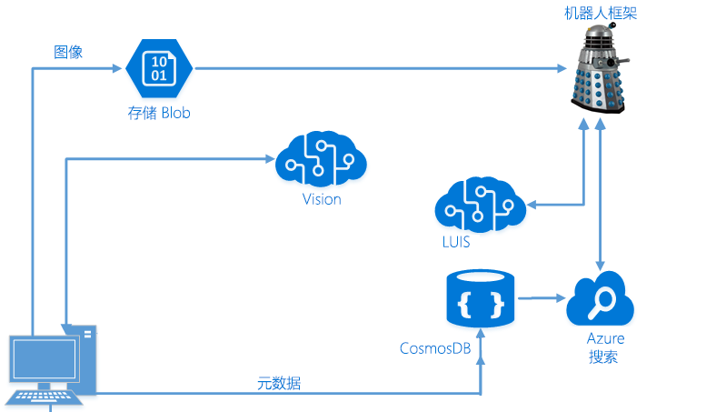

# 使用 LUIS 和 Azure 搜索开发智能应用程序

在此动手实验中，你将了解如何使用 Microsoft Bot Framework、Azure 搜索和 Microsoft 的语言理解智能服务 (LUIS) 从端到端创建智能机器人。

> **[2018/8/15] 重要说明！**
> 最近发布了适用于机器人框架的 v4 SDK 的[公共预览版](https://github.com/Microsoft/botbuilder-dotnet)。 目前还不知道何时将发布正式版。如果你想使用 v4 SDK（而不是 v3 SDK）来完成 lab02.2-building_bots，我们已将它设为默认用于实验 2.2。
> 如果你要在课程中使用这些材料（即不是自学），**请遵从讲师指导**。
> 如果你是重新递交本课程的讲师并且有任何疑问，请发送电子邮件到 learnanalytics@microsoft.com。

## 目标
在本研讨会中，你将学习以下内容：
- 了解如何实现 Azure 搜索功能，从而在应用程序内部提供积极的搜索体验
- 使用利用 LUIS 和 Azure 搜索的 Microsoft Bot Framework 生成智能机器人
- 使用正则表达式和可得分组来提高机器人的效率

## 先决条件：

本研讨会面向 Azure 的 AI 开发人员。由于这是一个简短的研讨会，因此在你参与之前需要具备一些条件。

第一，你应该拥有使用 Visual Studio 的经验。我们会将它用于我们在研讨会中构建的所有内容，因此你应熟悉[如何使用它](https://docs.microsoft.com/zh-cn/visualstudio/ide/visual-studio-ide) 来创建应用程序。此外，这不是一门教授如何编写代码或开发应用程序的课程。我们假设你知道如何使用 C# 编写代码（可以在[此处](https://mva.microsoft.com/zh-cn/training-courses/c-fundamentals-for-absolute-beginners-16169?l=Lvld4EQIC_2706218949) 学习如何编写代码），但是不知道如何实现高级搜索和 NLP（自然语言处理）解决方案。

第二，你应该拥有一些使用 Microsoft Bot Framework 开发机器人的经验。我们不会花太多时间讨论如何设计它们或对话的工作原理。如果你不熟悉 Bot Framework，则应该在参与研讨会之前参加[此 Microsoft 虚拟学院课程](https://mva.microsoft.com/zh-cn/training-courses/creating-bots-in-the-microsoft-bot-framework-using-c-17590#!)。

第三，你应该拥有使用门户的经验，并且能够在 Azure 上创建资源（和花钱）。我们不会为本研讨会提供 Azure Pass。

>**注意：**本研讨会的开发和测试是使用 Visual Studio Community 版本 15.4.0 在 Data Science Virtual Machine (DSVM) 上进行的

## 简介

我们将构建一个端到端的场景，使你能够引入自己的图片、使用认知服务查找图像中的对象和人物、了解那些人的感情以及将所有数据存储到 NoSQL 存储 (CosmosDB) 中。我们将使用该 NoSQL 存储来填充 Azure 搜索索引，然后使用 LUIS 生成一个 Bot Framework 机器人来进行简单、有针对性的查询。

> **注意：**本实验结合了本研讨会早期从各种实验（计算机视觉、Azure 搜索和 LUIS）中获得的一些结果。如果你没有完成上面列出的实验，则需要先完成 Azure 搜索和 LUIS 实验，然后再继续。或者，你可以请求使用邻座的 Azure 搜索/LUIS 实验中的密钥。

## 体系结构

在之前的实验中，我们构建了一个简单的 C# 应用程序，使你能够从本地驱动器中引入图片，然后调用[计算机视觉](https://www.microsoft.com/cognitive-services/zh-cn/computer-vision-api) 认知服务来抓取那些图像的标记和描述。

在获得此数据后，我们对其进行了处理并将所需的所有信息存储在了 [CosmosDB](https://azure.microsoft.com/zh-cn/services/documentdb/) 中，它是我们的 [NoSQL](https://en.wikipedia.org/wiki/NoSQL) [PaaS](https://azure.microsoft.com/zh-cn/overview/what-is-paas/) 服务。

将数据存储在 CosmosDB 中后，我们在它的顶部构建了一个 [Azure 搜索](https://azure.microsoft.com/zh-cn/services/search/) 索引。接下来，我们将构建一个 [Bot Framework](https://dev.botframework.com/) 机器人来查询它。我们还将通过 [LUIS](https://www.microsoft.com/cognitive-services/zh-cn/language-understanding-intelligent-service-luis) 扩展此机器人以自动从你的查询中派生出意图，并使用这些信息来智能地定向你的搜索。

> 这个实验按这个[认知服务教程](https://github.com/noodlefrenzy/CognitiveServicesTutorial) 进行了修改。

## 导航 GitHub ##

[资源](./resources)文件夹中包含几个目录：

- **assets**、**case**、**instructor**：出于本实验的目的，你可以忽略这些文件夹。
- **code**：其中包含我们将使用的几个目录：
	- **Models**：在我们将搜索添加到 PictureBot 时会用到这些类。
	- **Finished-PictureBot_Regex**：其中包含已完成的 PictureBot.sln，包括 Regex 的附加项。如果你跟不上进度或遇到困难，可以参考此目录中的内容。
	- **Finished-PictureBot_Search**：其中包含已完成的 PictureBot.sln，包括 Regex 和搜索的附加项。如果你跟不上进度或遇到困难，可以参考此目录中的内容。
	- **Finished-PictureBot_LUIS**：其中包含已完成的 PictureBot.sln，包括 Regex、LUIS 和 Azure 搜索的附加项。如果你跟不上进度或遇到困难，可以参考此目录中的内容。

> 你需要 Visual Studio 来运行这些实验，但如果你已经为其中一个研讨会部署了 Windows Data Science Virtual Machine，则可以使用此已部署的工具。

## 收集密钥

在本实验过程中，我们将收集各种密钥。建议将所有密钥保存在一个文本文件中，以便在整个研讨会期间能轻松地获取它们。

>_密钥_
>- LUIS API：
>- Cosmos DB 连接字符串：
>- Azure 搜索名称：
>- Azure 搜索密钥：
>- Bot Framework 应用名称：
>- Bot Framework 应用 ID：
>- Bot Framework 应用密码：

## 导航实验

本研讨会分为五个部分：
- [1_Regex_and_ScorableGroups](./1_Regex_and_ScorableGroups.md)：在此部分中，你将使用正则表达式和可得分组来生成一个简单的机器人
- [2_Azure_Search](./2_Azure_Search.md)：我们将为 Azure 搜索配置机器人，并将它连接到上一个实验中的 Azure 搜索服务
- [3_LUIS](./3_LUIS)：接下来，我们会将我们的 LUIS 模型合并到机器人中，这样当 Regex 无法识别用户意图时，我们就可以调用 LUIS。
- [4_Publish_and_Register](./4_Publish_and_Register.md)：我们最后要完成发布和注册机器人。
- [5_Challenge_and_Closing](./5_Challenge_and_Closing.md)：如果你完成了所有实验，请尝试这一挑战。你还可以找到一份摘要，其中包含已完成的工作以及了解详细信息的位置。

### 继续 [1_Regex_and_ScorableGroups](./1_Regex_and_ScorableGroups.md)

