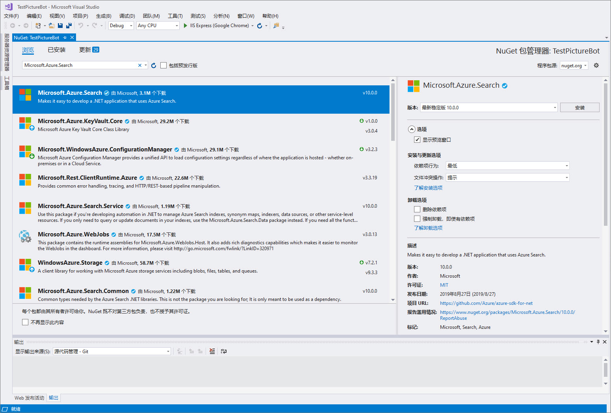

## 2_Azure 搜索：
预计用时：10-15 分钟

### 实验 2.1：为 Azure 搜索配置机器人 

首先，我们需要向机器人提供相关的信息以连接到 Azure 搜索索引。  最好将连接信息存储在配置文件中。  

打开 Web.config，然后在 appSettings 部分添加以下内容：

```xml    
    <!-- Azure Search Settings -->
    <add key="SearchDialogsServiceName" value="" />
    <add key="SearchDialogsServiceKey" value="" />
    <add key="SearchDialogsIndexName" value="images" />
```

将 SearchDialogsServiceName 的值设置为之前创建的 Azure 搜索服务的名称。  如有需要，请返回 [Azure 门户](https://portal.azure.com)中查找此名称。  

将 SearchDialogsServiceKey 的值设置为此服务的密钥。  该密钥可在 [Azure 门户](https://portal.azure.com)中 Azure 搜索的“密钥”部分下找到。  在下面的屏幕截图中，SearchDialogsServiceName 将为“aiimmersionsearch”，SearchDialogsServiceKey 将为“375...”。  

 

### 实验 2.2：更新机器人以使用 Azure 搜索

接下来，我们将更新机器人以调用 Azure 搜索。  首先，打开“工具”-->“NuGet 包管理器”-->“管理用于解决方案的 NuGet 包”。  在搜索框中，键入“Microsoft.Azure.Search”。  选择相应的库，选中指示项目的框，然后进行安装。  可能还会安装其他依赖项。在已安装的包下，你可能还需要更新“Newtonsoft.Json”包。

 

在 Visual Studio 的“解决方案资源管理器”中右键单击项目，然后选择“添加”-->“新建文件夹”。  创建一个名为“Models”的文件夹。  然后右键单击 Models 文件夹，并选择“添加”-->“现有项”。  执行此操作两次，将这两个文件添加到 Models 文件夹下（确保在必要时调整名称空间）：
1. [ImageMapper.cs](./resources/code/Models/ImageMapper.cs)
2. [SearchHit.cs](./resources/code/Models/SearchHit.cs)

>可在 [resources/code/Models](./resources/code/Models) 下的此存储库中找到这些文件。

接下来，右键单击 Visual Studio 的“解决方案资源管理器”中的 Dialogs 文件夹，然后选择“添加”-->“类”。  将类命名为“SearchDialog.cs”。在[此处](./resources/code/SearchDialog.cs)添加内容。

查看刚刚添加的文件的内容。与领座讨论每项内容的作用。

我们还需要更新你的 RootDialog 以调用 SearchDialog。  在 Dialogs 文件夹中的 RootDialog.cs 中，直接在 `ResumeAfterChoice` 方法下添加这些“ResumeAfter”方法：

```csharp

        private async Task ResumeAfterSearchTopicClarification(IDialogContext context, IAwaitable<string> result)
        {
            string searchTerm = await result;
            context.Call(new SearchDialog(searchTerm), ResumeAfterSearchDialog);
        }

        private async Task ResumeAfterSearchDialog(IDialogContext context, IAwaitable<object> result)
        {
            await context.PostAsync("Done searching pictures");
        }

```

在 RootDialog.cs 中，还需要从行中删除注释（开头的 `//`）：`ResumeAfterChoice` 方法内的 `PromptDialog.Text(context, ResumeAfterSearchTopicClarification, "What kind of picture do you want to search for?");`。

按 F5 再次运行你的机器人。  在机器人仿真器中，尝试搜索“狗”或“水”之类的东西。  确保在请求图片中的标记时你能看到结果。  


### 继续 [3_LUIS](./3_LUIS.md)  
返回 [README](./0_README.md)
