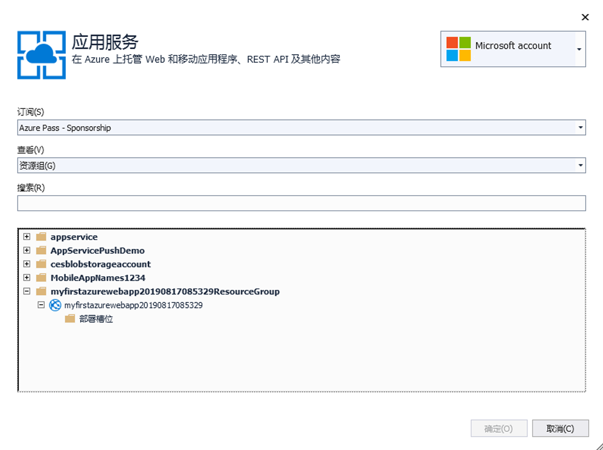

## 4_发布和注册：
预计用时：10-15 分钟

### 实验 4.1：发布机器人

使用 Microsoft Bot Framework 创建的机器人可以在任何可公开访问的 URL 上托管。  出于本实验的目的，我们将使用 [Azure 机器人服务](https://docs.microsoft.com/zh-cn/bot-framework/bot-service-overview-introduction)注册我们的机器人。

导航到门户。在门户中，单击“创建资源”并搜索“机器人”。选择“Web App Bot”，然后单击“创建”。对于名称，必须创建唯一标识符。建议使用类似 PictureBot[i][n] 的内容，其中 [i] 是你的姓名缩写，[n] 是一个数字（例如，我使用的是 PictureBotamt40）。放在离你最近的区域。
对于定价层，请选择 F0，因为这是我们本次研讨会所需的全部内容。将机器人模板设置为基础 (C#)，并配置新的应用服务计划（将其放置于机器人所在的同一位置）。选择哪个模板无关紧要，因为我们将使用 PictureBot 对其进行覆盖。关闭 Application Insights（以节省资金）。单击“创建”。

 

你刚刚发布了一个非常简单的 EchoBot（类似于我们之前开始时使用的模板）。我们接下来要做的是将 PictureBot 发布到此机器人服务中。

首先，我们需要获取一些密钥。转到刚刚创建的 Web App Bot（位于门户中）。在“应用服务设置”->“应用程序设置”->“应用设置”下，获取 BotId、MicrosoftAppId 和 MicrosoftAppPassword。你稍后需要用到它们。

返回 Visual Studio 中的 PictureBot。在 Web.config 文件中，使用 BotId、MicrosoftAppId 和 MicrosoftAppPassword 填写 `appSettings` 下的空白。保存文件。 

> 出现了指向 MicrosoftAppPassword 的错误？由于该文件为 XML 格式，因此，如果密钥包含“&”、“<”、“>”、“'”或“"”，则需要将它们替换为各自的[转义字符](https://en.wikipedia.org/wiki/XML#Characters_and_escaping)：“&amp;”、“&lt”、“&gt;”、“&apos;”、“&quot;”。 

在解决方案资源管理器中，右键单击“机器人应用程序”项目并选择“发布”。  这将启动一个向导，可帮助你将机器人发布到 Azure。  

选择“Microsoft Azure 应用服务”的发布目标并“选择现有项”。  

 

在“应用服务”屏幕上，选择适当的订阅、资源组和你的机器人服务。选择“发布”。

 

> 如果此处出现错误，只需退出 Visual Studio 中的浏览器窗口并完成下一步即可。

现在，你将看到“Web 部署”设置，但还须对其进行最后一次编辑。选择发布配置文件下的“设置”。再次选择“设置”，然后选中“删除目标中的其他文件”旁边的框。单击“保存”退出该窗口，然后立即单击“发布”。  Visual Studio 中的输出窗口将显示部署过程。  然后，你的机器人将托管在类似于 http://picturebotamt6.azurewebsites.net/ 的 URL 上，其中“picturebotamt6”是机器人服务应用名称。  

 

### 从门户管理机器人

返回到 Web App Bot 资源的门户。在“机器人管理”下，选择“在 Web 聊天中测试”，测试机器人是否已发布并正常工作。如果不是，请查看上一个实验，因为你可能跳过了一步。重新发布并返回此处。

确认机器人已发布并正常工作后，请查看“机器人管理”下的其他一些功能。选择“渠道”，请注意渠道有很多，当你选择一个渠道时，便会向你说明其配置方法。 

想进一步了解与机器人相关的各个方面？请花点时间阅读[操作说明和设计原则](https://docs.microsoft.com/zh-cn/bot-framework/bot-service-design-principles)。

### 继续 [5_Challenge_and_Closing](./5_Challenge_and_Closing.md)  
返回 [README](./0_README.md)
