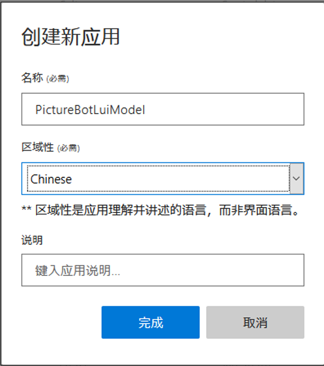
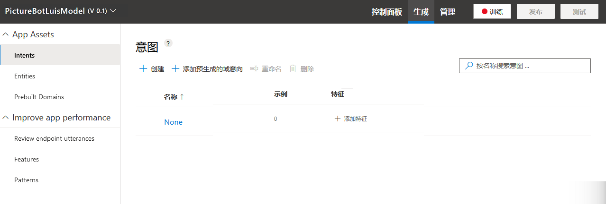
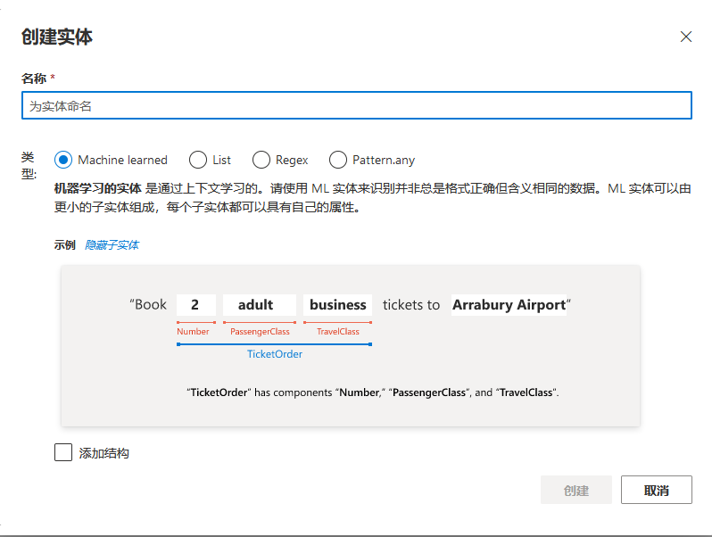
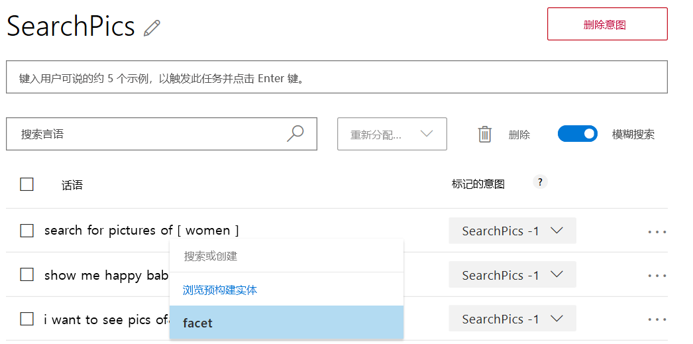
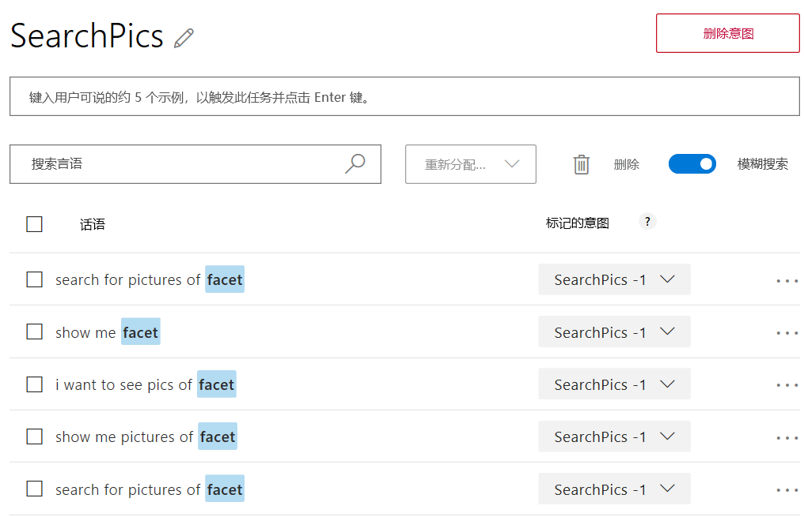

# 实验室 6：实现 LUIS 模型

此动手实验将指导你使用 Microsoft 的语言理解智能服务 (LUIS) 创建模型，以改善应用程序的自然语言处理功能。

## 简介

在本实验中，你将生成、训练和发布 LUIS 模型，以帮助（将在未来的实验中创建）的机器人与人类用户进行有效沟通。

> **注：**在本实验中，我们将仅创建 LUIS 模型，用于在未来的实验中生成更加智能的机器人。

本研讨会已经介绍了 LUIS 的特性和功能；如需复习 LUIS，请[参阅详细信息](https://docs.microsoft.com/zh-cn/azure/cognitive-services/LUIS/Home)。

我们现已了解 LUIS 的含义，接着就要规划 LUIS 应用。我们已经创建了一个基本的机器人（“PictureBot”）来响应包含某些文本的消息。我们需要创建可以触发机器人执行不同操作的意图，并创建需要执行不同操作的实体。例如，PictureBot 的意图可能是“OrderPic”，并且它触发机器人提供相应的响应。

例如，在搜索（此处未实现）的情况下，PictureBot 的意图可能是“SearchPics”，它触发 Azure 认知搜索服务查找照片，此操作需要“facet”实体了解要搜索的内容。  可在[此处](https://docs.microsoft.com/zh-cn/azure/cognitive-services/LUIS/plan-your-app)查看更多规划应用的示例。

构思好应用后，我们就可以[生成并对其进行训练](https://docs.microsoft.com/zh-cn/azure/cognitive-services/LUIS/luis-get-started-create-app)。

作为回顾，以下是在创建 LUIS 应用程序时通常要采取的步骤：

  1. [添加意图](https://docs.microsoft.com/zh-cn/azure/cognitive-services/LUIS/add-intents)
  2. [添加言语](https://docs.microsoft.com/zh-cn/azure/cognitive-services/LUIS/add-example-utterances)
  3. [添加实体](https://docs.microsoft.com/zh-cn/azure/cognitive-services/LUIS/add-entities)
  4. [使用短语列表提高性能](https://docs.microsoft.com/zh-cn/azure/cognitive-services/LUIS/add-features)和[模式](https://docs.microsoft.com/zh-cn/azure/cognitive-services/LUIS/luis-how-to-model-intent-pattern)
  5. [训练和测试](https://docs.microsoft.com/zh-cn/azure/cognitive-services/LUIS/train-test)
  6. [检查终结点言语](https://docs.microsoft.com/zh-cn/azure/cognitive-services/LUIS/label-suggested-utterances)
  7. [发布](https://docs.microsoft.com/zh-cn/azure/cognitive-services/LUIS/publishapp)

## 实验 6.0：在门户中创建 LUIS 服务（可选）

在门户中创建 LUIS 服务是可选操作，因为 LUIS 为你提供了“入门密钥”，可在实验中直接使用。但是，如果要了解如何在门户中创建免费或付费服务，则可以按照下面的步骤操作。  

> **注**：如果运行 pre-req ARM 模板，则已有一个包括语言理解 API 的认知服务资源。

1. 打开 [Azure 门户](https://portal.azure.com)

1. 选择 **“创建资源”**。

1. 在搜索框中输入 **“语言理解”** 并选择 **“语言理解”**

1. 选择 **“创建”**

1. 在名称处输入 **“{YOURINIT}luisbot”**

1. 选择订阅以及与资源组相似的位置

1. 在定价层处选择 **“F0”**

1. 选择你的资源组

1. 对于运行时位置，请选择与资源组相似的位置

1. 对于运行时定价，请选择 **F0**

1. 选择 **“创建”**

**注**：Luis AI 网站不允许控制或发布基于 Azure 的认知服务资源。  需要调用 API 来进行训练和发布。

## 实验 6.1：使用 LUIS 为应用程序添加智能功能

我们来学习如何使用 LUIS 添加一些自然语言功能。使用 LUIS，可以将自然语言（用户在与机器人交谈时可能会用到的单词/短语/句子）映射到意图（用户想要执行的任务或操作）中。就我们的应用程序而言，可能有几个意图，例如：查找图片、共享图片和订购图片打印件。我们可以举几个示例言语作为询问这些内容的方法，并且 LUIS 将根据其学到的内容将其他新的言语映射到每个意图。

> **警告**：虽然 Azure 服务使用 IE 作为默认浏览器，但我们不建议将其用于 LUIS。应该可以在所有实验中使用 Chrome 或 Firefox。或者，也可以下载 [Microsoft Edge](https://www.microsoft.com/zh-cn/download/details.aspx?id=48126) 或 [Google Chrome](https://www.google.com/intl/en/chrome/)。

1. 导航至 [https://www.luis.ai](https://www.luis.ai)（**除非你位于欧洲或澳大利亚***）。我们将创建一个新 LUIS 应用来支持机器人。

> **注**：如果你在 **“欧洲”** 区域创建了密钥，则需要在 [https://eu.luis.ai/](https://eu.luis.ai/) 创建应用程序。如果你在 **“澳大利亚”** 区域创建了密钥，则必须在 [https://au.luis.ai/](https://au.luis.ai/) 创建你的应用程序。可在[此处](https://docs.microsoft.com/zh-cn/azure/cognitive-services/luis/luis-reference-regions)详细了解 LUIS 发布区域。

1. 使用组织或 Microsoft 帐户进行登录。该帐户应与上一节中用于创建 LUIS 密钥的帐户相同。

1. 选择 **“立即创建 LUIS 应用”**。应重定向到 LUIS 应用程序的列表。  如果出现提示，请选择 **“稍后迁移”**。  

1. 若是第一次使用，系统会要求你同意服务使用条款并选择你所在的区县。

- 在下一步中，需要选择推荐选项，并将 Azure 帐户与 LUIS 关联。
- 最后，确认设置，随后你将转到 LUIS 应用页面。

> **注意**：请注意，[当前页面](https://www.luis.ai/applications)上的“新应用”按钮旁边也有一个“导入应用”。  创建 LUIS 应用程序后，可以将整个应用导出为 JSON 并将其签入源代码管理。  这是建议的最佳做法，因此你可以在编写代码时对 LUIS 模型进行版本控制。  可以使用“导入应用”按钮重新导入导出的 LUIS 应用。  如果跟不上实验室的进度并想走捷径，则可以单击“导入应用”按钮并导入 [LUIS 模型](./code/LUIS/PictureBotLuisModel.json)。

1. 在主页上选择 **“新建应用”** 按钮

1. 键入名称，然后选择 **“完成”**。  关闭“如何创建有效的 LUIS 应用”对话框。

1. 在顶部导航中，选择 **“生成”链接**。  请注意，存在名为“None”的意图。  不映射到任何意图的随机言语可能会映射到“None”。

我们希望机器人能够执行以下操作：

- 搜索/查找图片
- 在社交媒体上分享图片
- 订购图片打印件
- 问候用户（不过这也可以通过其他方式完成，我们稍后会了解这一点）

让我们为请求实现其中每一项的用户创建意图。  

1. 选择 **“新建意图”** 按钮。

1. 将第一个意图命名为 **“Greeting”**，然后选择 **“完成”**。  

1. 提供几个用户在问候机器人时可能回应的言语示例，并在提供每个示例后按 Enter。

我们来了解一下如何创建实体。  用户请求搜索图片时，他们可以指定要寻找的内容。  让我们在实体中捕获该内容。

1. 在左列中选择 **“实体”**，然后选择 **“+ 创建”**。  

1. 将实体命名为 **“facet”**

1. 对于实体类型，请选择 **“机器学习”**。  

1. 选择 **“创建”**。

1. 选择左侧边栏中的 **“意图”**，然后单击 **“新建意图”按钮**。  

1. 请将意图命名为 **“SearchPics”**，然后单击 **“完成”**。

与针对问候语执行的操作一样，让我们添加一些示例言语（用户在与机器人交谈时可能会用到的单词/短语/句子）。  人们可能会通过多种方式搜索图片。  请随意使用下面的一些言语，并添加自己要求机器人搜索图片会使用的措辞。

- 查找户外图片
- 有没有火车图像？
- 查找食物的图像。
- 搜索正在玩耍的小孩的照片
- 显示海滩图片
- 查找狗的照片
- 显示眼镜男图像
- 显示快乐婴儿图片

使用一些言语后，我们必须让 LUIS 了解如何挑选**搜索主题**作为“facet”实体。“facet”实体选择的所有内容都将被搜索。

1. 请将鼠标悬停在该单词上并单击它（或单击连续单词以选择一组单词），然后选择“facet”实体。

因此，标注 facets 时，言语可能会变成以下内容：

>**注意**：此研讨会不涵盖 Azure 认知搜索，但是，为了演示，此功能已保留。

1. 选择左侧边栏中的 **“意图”**，并添加另外两个意图：

- 将其中一个意图命名为 **“SharePic”**。  可以通过如下言语识别：

  - 分享此图片
  - 可以把它发到 Twitter 吗？
  - 发布到 Twitter

- 创建另一个名为 **“OrderPic”** 的意图。  可以通过如下言语沟通：

  - 打印此图片
  - 我想订购打印件
  - 可以给我一张 8x10 的打印件吗
  - 订购钱包

选择言语时，使用问题、命令和“我想…”格式的组合会很有帮助。

1. 最后，请在“None”意图中添加一些示例言语。事情超出应用程序的范围时，使用 LUIS 标签非常有帮助。添加诸如“我饿了，想吃比萨饼”、“搜索视频”等项。None 意图中应有大约 10-15％ 的应用言语。

## 实验 6.2：训练 LUIS 模型

现在准备训练模型。在本练习中，你将执行一个简单的训练操作以测试你的模型。  测试将使用 LUIS 门户中的内置测试面板进行。

1. 在顶部菜单中，选择 **“训练”**。在训练过程中，LUIS 建立了一个模型，根据你提供的训练数据将话语映射到意图。

    > [!提示]
    > 训练并不总是立竿见影。有时还会排队等待，并且可能需要几分钟时间。

## 创建 LUIS 服务的公共终结点

1. 培训结束后，选择顶部工具栏中 **“管理”**。以下选项将出现在左侧工具栏上：

    > [!NOTE]
    > 门户更新时，左窗格上的类别可能会更改。  结果，密钥和终结点可能属于与此处列出的类别不同的类别。

    - **发布设置**
    - **Azure 资源**
    - **版本**
    - **协作者**

1. 选择 **“Azure 资源”**。该屏幕用于管理用于访问 LUIS 服务的 URL 终结点。

    > [!NOTE]
    > 名为 **Starter_Key** 的终结点是自动创建的，用于测试目的，你可以在此处使用它 - 但是，要在生产环境或应用程序内部使用该服务，始终需要将其绑定到在 Azure 中创建的真实“语言理解”资源。

1. 你应该看到已创建 **“预测资源”**和 **Starter_Key** 资源。  如果看到 **“预测资源”**，请转到 **“发布应用”** 上的下一部分。
1. 如果看不到现有 **“预测资源”**，请选择 **“添加预测资源”**。**租户**已经被选中。
1. 选择你的订阅，以及你先前在 Azure 门户中创建的资源，然后选择 **“完成”**，将“语言理解”资源连接到 LUIS 服务。

## 发布应用

1. 在顶部工具栏中，选择 **“发布”**。

   > [!NOTE]
   > 你可以发布到你的 **“生产”** 或 **“暂存”** 终结点。选择 **“生产”**，然后了解两个终结点的原因。

1. 在 **“选择你的发布位置和设置”** 下，选择 **“生产槽”**，然后选择 **“完成”**。

    发布会创建终结点，以调用 LUIS 模型。终结点 URL 将会显示。复制终结点 URL 并将其添加到密钥列表中以备将来使用。

1. 在顶部栏中，选择 **“测试”**。尝试输入一些话语，并查看返回的意图。以下是一些你可以尝试的示例：

   | 话语 | 结果 | 分数含义 |
   |---------|---------|---------|
   | **给我看当地海滩的照片** | 返回 **SearchPic** 意向得分 | 正面比赛 |
   | **Hello** | 返回 **Greeting** 意向得分 | 相当正面的比赛 |
   | **发送给 Tom** | 返回低分数的 **“实用工具”** | 需要再培训或与任何意图都不符 |

要针对低分数的话语重新训练模型，请执行以下步骤：

1. 在得分较低的话语（在这种情况下为**发送给 Tom**）旁，选择 **“检查”**。
1. 在**得分最高的意图**旁，选择下拉菜单并从列表中选择 **SharePic**。
1. 关闭 **“测试”** 面板。
1. 选择 **“训练”** 按钮以重新训练你的模型。
1. 再测试一次 **“发送给 Tom”** 话语。现在应返回得分较高的 **SharePic** 意向。

现在，你的 LUIS 应用已准备就绪，可以供客户端应用使用，通过列出的终结点在浏览器中进行测试或集成到机器人中。

你也可以[在浏览器中测试发布的终结点](https://docs.microsoft.com/zh-cn/azure/cognitive-services/LUIS/PublishApp#test-your-published-endpoint-in-a-browser)。复制终结点 URL。要在浏览器中打开此 URL，请将 URL 参数 `&q=` 设置为测试查询。例如，请将 `Find pictures of dogs` 追加到 URL，然后按 Enter。浏览器显示 HTTP 终结点的 JSON 响应。

## 延伸阅读

如果仍有时间，可以花些时间浏览 www.luis.ai 网站。选择“预建域”并查看[已可用的域](https://docs.microsoft.com/zh-cn/azure/cognitive-services/luis/luis-reference-prebuilt-domains)。你也可以查看一些[其他功能](https://docs.microsoft.com/zh-cn/azure/cognitive-services/luis/luis-concept-feature)和[模式](https://docs.microsoft.com/zh-cn/azure/cognitive-services/luis/luis-concept-patterns)
，以及查看用于创建 LUIS 模型、管理 LUIS 模型、模拟对话等的 [BotBuilder 工具](https://github.com/Microsoft/botbuilder-tools)。之后，你可能还对[涵盖如何设计 LUIS 架构的另一门课程](https://aka.ms/daaia)感兴趣。

## 友情提示

如果希望尝试创建包含 Azure 认知搜索的 LUIS 模型，请按照[包含搜索的 LUIS 模型](https://github.com/Azure/LearnAI-Bootcamp/tree/master/lab01.5-luis)培训进行操作。

## 后续步骤

- [实验 07-01：集成 LUIS](../Lab7-Integrate_LUIS/01-Introduction.md)
